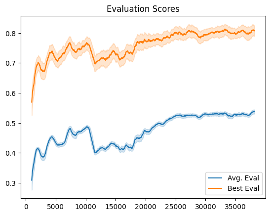
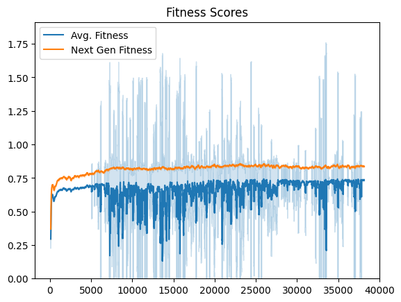
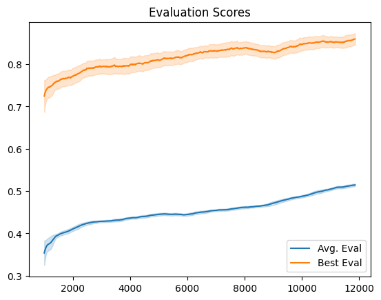
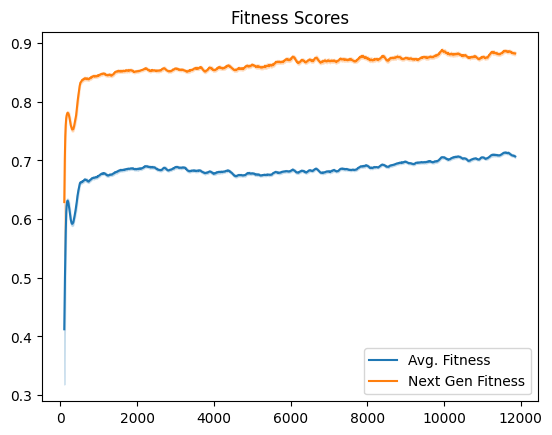
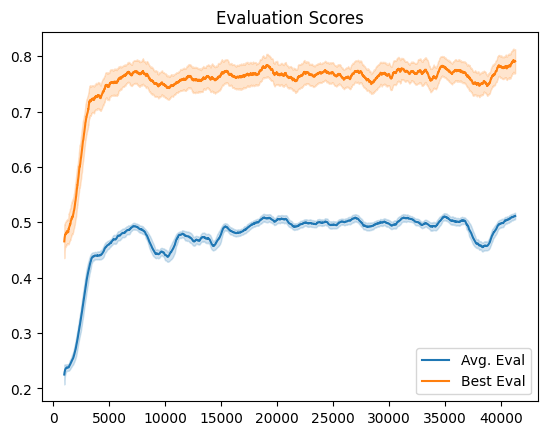
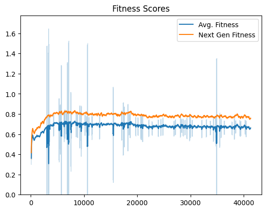

# Version 1

There's a lot of parameters to juggle around in this project, so I'll try to get them all documented here. Assume that everything is the same as the Default params, and only deviations from these parameters are reported.

## Defaults

    xover_rate=0.75
    mute_rate=0.05
    mute_stren=0.25
    xover_alpha=0.1
    hybrid_init=True

Population: 100
Culling rate: 50%s
`NUM_SEXES=5`
`MAX_GAME_LEN=2_000`

  
  
  
<i>Fig 1</i>. Default training values

## `large_pop`

Population: 1,000
Culling rate: 90%

  
  
  
<i>Fig 2</i>. Large population training values

## `rand_init`

    hybrid_init=False

  
  
  
<i>Fig 3</i>. Randomly initialized genes training values

