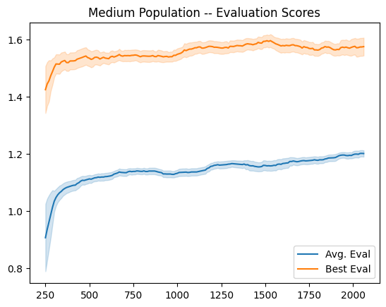
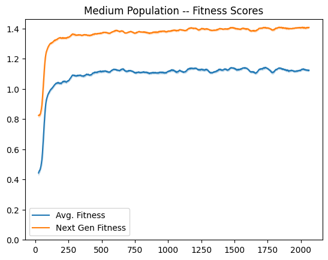
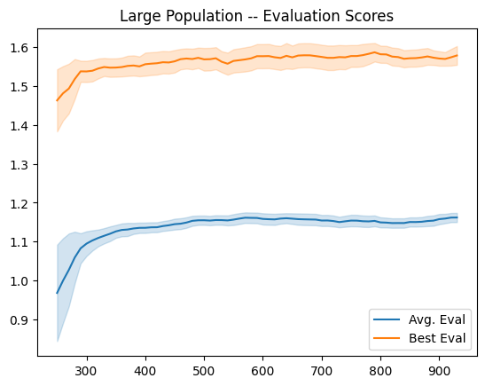
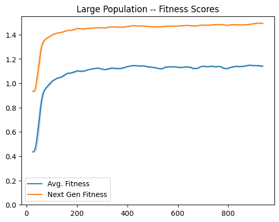
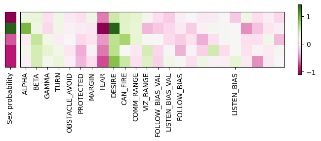

# V2

Changes:

* Added obstacles
* Added gene to avoid obstacles
* Added genes for comm and vision ranges (bounded by phys_globals)
* Corrected physics glitch to cap rotational velocity
* Using annealed curriculum learning to always have to fight some default drones
* Decreased population size to account for extra overhead from raytracing in shooting sims

Defaults:

    ap.add_argument('--game-size', default=50, type=int)
    ap.add_argument('--population', default=100, type=int)
    ap.add_argument('--cull-rate', default=2, type=int)
    ap.add_argument('--device', default='cpu')
    ap.add_argument('--gene-init', default='baseline', choices=['hybrid', 'random', 'baseline'])
    ap.add_argument('--xover-rate', default=0.75, type=float)
    ap.add_argument('--mute-rate', default=0.05, type=float)
    ap.add_argument('--mute-stren', default=0.25, type=float)
    ap.add_argument('--xover-alpha', default=0.1, type=float)
    ap.add_argument('--save-rate', default=100, type=int)
    ap.add_argument('--eval-rate', default=10, type=int)
    ap.add_argument('--num-obstacles', default=10, type=int)
    ap.add_argument('--min-baseline-games', default=0.15, type=float)
    ap.add_argument('--annealing-steps', default=5000)
    ap.add_argument('--tag')

## Med Pop

    --population 400
    --cull-rate 4

  
  
  
<i>Fig 1</i>. Medium Population

## Large Pop

    --population 1000
    --cull-rate 10

  
  
  
<i>Fig 2</i>. Large Population

  
  
<i>Fig 3</i>. Most fit genes

Populations all just developed one sex of extremely violent drones (no fear, not listening or communicating with anyone else). V3 introduces tradeoffs to try to avoid this.